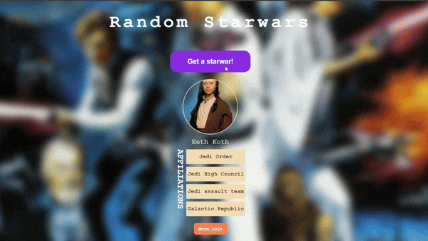

# Random Starwar using jQuery AJAX

## Description

This project is a simple project that uses jQuery AJAX to fetch random Starwar character from the [Starwar API](https://akabab.github.io/starwars-api/). The project is a part of the Udemy course [The Ultimate Fullstack Web Development Bootcamp](https://www.udemy.com/course/the-ultimate-fullstack-web-development-bootcamp/?couponCode=JUST4U02223).

## Technologies

- HTML
- CSS
- JavaScript
- jQuery
- AJAX

## Demo

